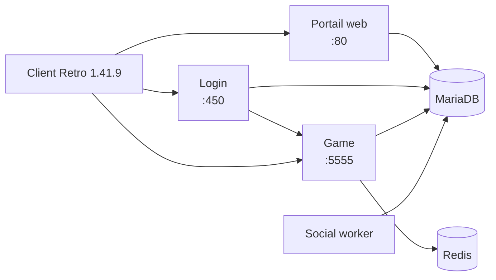

<div align="center">

# StarLoco Offline

### Un environnement privé Dofus Retro 1.41.9, du client jusqu'au serveur

[](#jeu-depuis-la-machine-hôte)
[](#démarrage-rapide)
[](#développement)
[](#jeu-depuis-la-machine-hôte)

Pile StarLoco autonome, portail web, outils d'administration et client Retro
réunis dans un seul dépôt pour jouer sur une machine locale ou depuis l'hôte
d'une machine virtuelle.

</div>

> [!IMPORTANT]
> Ce dépôt est un projet communautaire non officiel, destiné à un usage privé,
> local et expérimental. Il n'est ni affilié à Ankama ni approuvé par celle-ci.

## Ce que contient le projet

| Composant | Description |
|---|---|
| **Client Retro 1.41.9** | Client Windows configuré pour une connexion directe au serveur |
| **Serveur Login** | Authentification, liste des mondes et transfert vers le serveur de jeu |
| **Serveur Game** | Monde StarLoco, personnages, combats, quêtes, objets et métiers |
| **Portail web** | Inscription, annuaire des joueurs et fil communautaire |
| **Administration** | Gestion locale des personnages, objets, kamas et comptes |
| **Outillage hors ligne** | Démarrage, migrations, diagnostics, tests et reconstruction |

Cette version intègre notamment des adaptations pour Retro 1.41.9 :

- distribution par le serveur des fichiers de langue et de cartes compatibles ;
- correction des intitulés de quêtes affichés comme `[object Object]` ;
- mécanisme de repli pour les cartes dont la révision diffère côté client ;
- correction du chargement de certains objets, icônes et noms formatés ;
- normalisation des conditions de drop historiques ;
- durcissement des sessions, requêtes et pages de la console d'administration.

## Architecture



MariaDB, Redis et le canal interne Login/Game ne sont pas publiés sur le
réseau. Seuls les ports nécessaires au client et au portail sont exposés.

## Prérequis

- Linux avec Docker Engine et le plugin Docker Compose ;
- Git LFS pour récupérer les fichiers volumineux suivis par le dépôt ;
- suffisamment d'espace pour les images Docker, la base MariaDB et le client ;
- Windows ou un environnement compatible pour exécuter le client fourni.

La pile a été préparée et validée sous Ubuntu 24.04. Java, Gradle, PHP,
MariaDB et Redis s'exécutent dans des conteneurs et n'ont pas à être installés
sur l'hôte.

Après un clone, récupérez les objets LFS :

```bash
git lfs install
git lfs pull
```

> [!NOTE]
> L'archive `docker-images/starloco-images.tar` est volontairement exclue de
> Git en raison de sa taille. Le démarrage fonctionne si les images sont déjà
> chargées dans Docker ou si cette archive a été ajoutée séparément. Le script
> `prepare-online.sh` permet au mainteneur de reconstruire un paquet complet
> depuis une machine connectée.

## Démarrage rapide

Depuis la racine du dépôt :

```bash
cd starloco-offline
./offline-start.sh
```

Le script prépare les secrets locaux, initialise ou migre la base, démarre les
services dans le bon ordre et attend leurs contrôles de santé.

Créez ensuite un compte :

```bash
./offline-create-account.sh
```

ou ouvrez la page d'inscription :

```text
http://127.0.0.1/register.php
```

Les identifiants de la console d'administration sont générés localement :

```bash
./offline-admin-password.sh
```

### Accès web

| Page | Adresse locale |
|---|---|
| Fil communautaire | <http://127.0.0.1/> |
| Création de compte | <http://127.0.0.1/register.php> |
| Annuaire des joueurs | <http://127.0.0.1/players> |
| Administration | <http://127.0.0.1/admin/> |

## Jeu depuis la machine hôte

La configuration actuelle cible la VM à l'adresse `192.168.56.101`. Pour une
autre adresse, utilisez partout l'IP joignable depuis la machine qui lance le
client.

Dans `starloco-offline/runtime/stack/.env` :

```dotenv
BIND_ADDRESS=192.168.56.101
GAME_SERVER_IP=192.168.56.101
```

Dans `Retro-1.41.9/Retro/resources/app/retroclient/config.xml` :

```xml
<connserver name="StarLoco local" ip="192.168.56.101" port="450"/>
<dataserver url="http://192.168.56.101/" priority="4"/>
```

Puis redémarrez la pile :

```bash
cd starloco-offline
./offline-start.sh
```

Lancez enfin `Retro-1.41.9/Retro/Dofus Retro.exe` et sélectionnez
**StarLoco local**.

Les ports TCP suivants doivent être joignables depuis l'hôte :

| Port | Rôle | Nécessaire |
|---:|---|:---:|
| `450` | authentification | oui |
| `5555` | serveur de jeu | oui |
| `80` | portail et données client compatibles | oui |
| `666` | échange interne Login/Game | non |

`GAME_SERVER_IP` est essentiel : c'est l'adresse que Login transmet au client
pour rejoindre le serveur Game.

## Commandes utiles

Toutes les commandes suivantes s'exécutent depuis `starloco-offline/`.

```bash
# État et journaux
./offline-status.sh
./offline-logs.sh
./offline-logs.sh game

# Diagnostic et parcours réseau automatisé
./offline-doctor.sh --database
./offline-smoke-test.sh
./offline-verify.sh

# Comptes et administration
./offline-create-account.sh
./offline-admin-password.sh
./offline-admin-password.sh --reset

# Cycle de vie
./offline-start.sh
./offline-start.sh --portal-only
./offline-stop.sh
```

Les données persistantes résident dans les volumes Docker
`starloco_mariadb_data` et `starloco_redis_data`.

## Développement

Les sources modifiables du serveur de jeu se trouvent dans
`starloco-offline/serveur-jeu/`. Celles du serveur Login se trouvent dans
`starloco-offline/sources/StarLoco-Login/`.

```bash
cd starloco-offline

# Serveur Game
./game-dev.sh test
./game-dev.sh deploy

# Reconstruction des images
./offline-rebuild.sh login
./offline-rebuild.sh all
```

Le déploiement du serveur Game conserve une image de retour arrière et la
restaure automatiquement si le nouveau conteneur ne devient pas sain.

### Validation

```bash
cd starloco-offline
./offline-verify.sh
./offline-doctor.sh --database
./offline-smoke-test.sh
```

Le smoke test parcourt le protocole 1.41.9 : authentification, découverte du
monde, création et sélection d'un personnage, inventaire, sorts, chargement
d'une carte, reconnexion puis nettoyage des données temporaires.

## Structure du dépôt

```text
.
├── Retro-1.41.9/                  client Windows configuré
└── starloco-offline/
    ├── serveur-jeu/               sources Java du serveur Game
    ├── sources/StarLoco-Login/    sources Java du serveur Login
    ├── runtime/stack/             Compose, portail et configuration active
    ├── tests/                     tests automatisés
    ├── docker-images/             emplacement du paquet d'images hors ligne
    └── offline-*.sh               outils d'exploitation
```

## Documentation

- [Guide complet de la pile](starloco-offline/README.md)
- [Configuration du client Retro 1.41.9](starloco-offline/CLIENT-DOFUS-RETRO-1.41.9.md)
- [Développement du serveur](starloco-offline/DEVELOPPEMENT-SERVEUR.md)
- [Audit technique et limites](starloco-offline/AUDIT.md)
- [Fil communautaire](starloco-offline/FIL-COMMUNAUTAIRE.md)

## Sécurité

La pile est conçue pour un réseau privé.

- N'exposez pas MariaDB, Redis ou le port interne `666`.
- N'exposez jamais `/admin/` directement sur Internet.
- Préférez un VPN privé ou un tunnel SSH pour l'administration distante.
- Ne versionnez pas `runtime/stack/.env` ni `runtime/stack/secrets/`.
- Sauvegardez le volume MariaDB avant une migration importante.

## Statut et droits

La validation automatisée ne remplace pas un test graphique exhaustif de
toutes les fonctions du client. Certaines extensions propres aux versions
récentes de Retro peuvent rester non implémentées.

Le dépôt rassemble des adaptations autour de
[StarLoco-Game](https://github.com/StarLoco/StarLoco-Game),
[StarLoco-Login](https://github.com/tiboitel/StarLoco-Login) et
[starloco-docker](https://github.com/tiboitel/starloco-docker).
Le client, les marques et les ressources Dofus restent la propriété de leurs
ayants droit respectifs. Vérifiez les licences et droits de redistribution
applicables avant toute publication publique.

<div align="center">

**Conçu pour retrouver un monde Retro local, reproductible et maîtrisé.**

</div>
